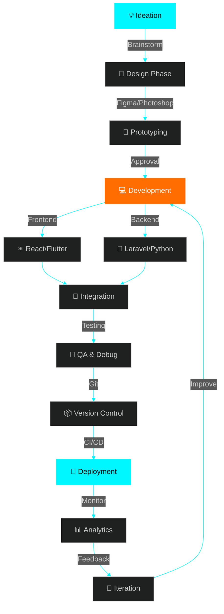

<h1 align="center">
  
</h1>

<div align="center">
  
</div>

<br/>

<!-- <p align="center">
  
</p> -->

<!-- <p align="center">
  
</p> -->

<p align="center">
  
</p>

---

<div align="center">
  
### 🎭 WHO AM I?

 **Full Stack Architect** | **Mobile Development Wizard** | **UI/UX Enthusiast** 

</div>

```javascript
class Developer {
  constructor() {
    this.name = "Elite Developer";
    this.role = "Full Stack & Mobile Engineer";
    this.location = "🌍 Casablanca, Morocco";
    this.expertise = ["Web", "Mobile", "Cloud", "Design"];
  }

  getDailyRoutine() {
    return [
      "☕ Coffee++",
      "💻 Code with passion",
      "🎨 Design beautiful UIs",
      "📱 Build mobile magic",
      "🚀 Deploy innovations",
      "🌙 Dream in algorithms"
    ];
  }

  getCurrentMission() {
    return "Transforming ideas into pixel-perfect digital experiences";
  }
}

const me = new Developer();
console.log(me.getCurrentMission());
// Output: "Transforming ideas into pixel-perfect digital experiences"
```

<p align="center">
  
</p>

---

<div align="center">
  
## 🌟 SPECIALIZATION MATRIX 🌟

</div>

<table align="center">
<tr>
<td align="center" width="50%">

### 🌐 WEB DEVELOPMENT

<br/>

**Frontend Mastery**
- ⚛️ React.js Ecosystem Expert
- 🔄 Advanced Redux Patterns
- 🎨 Modern CSS Architectures
- ⚡ Performance Optimization

**Backend Engineering**
- 🐘 PHP & Laravel Framework
- 🐍 Python Development
- 🏗️ RESTful API Design
- 🔐 Authentication & Security

</td>
<td align="center" width="50%">

### 📱 MOBILE DEVELOPMENT

<br/>

**Cross-Platform Excellence**
- 🎯 Flutter Dart Specialist
- ⚛️ React Native Pro
- 🎬 Complex Animations
- 📦 State Management

**Native Experience**
- 📲 iOS & Android Optimization
- 🔥 Firebase Integration
- 🌐 API Integration
- 💾 Offline-First Architecture

</td>
</tr>
</table>

<p align="center">
  
</p>

---

<div align="center">

## 🛠️ TECHNOLOGY ARSENAL 🛠️


### ⚡ Frontend Technologies

</div>

<p align="center">
  
</p>

<p align="center">
  
  
  
  
  
  
  
</p>

<div align="center">

### 🔧 Backend Technologies

</div>

<p align="center">
  
</p>

<p align="center">
  
  
  
</p>

<div align="center">

### 📱 Mobile Technologies

</div>

<p align="center">
  
</p>

<p align="center">
  
  
  
</p>

<div align="center">

### 🗄️ Databases

</div>

<p align="center">
  
</p>

<p align="center">
  
  
  
  
</p>

<div align="center">

### 🎨 Design & Development Tools

</div>

<p align="center">
  
</p>

<p align="center">
  
  
  
  
  
  
</p>

<p align="center">
  
</p>

---

<div align="center">

## 📊 GITHUB PERFORMANCE METRICS 📊


</div>


---

<div align="center">

## 🎯 DEVELOPMENT PHILOSOPHY 🎯

</div>

<table align="center">
<tr>
<td align="center" width="33%">

<br/>
**💡 INNOVATION**

Pushing boundaries with<br/>
cutting-edge technologies<br/>
and creative solutions

</td>
<td align="center" width="33%">

<br/>
**🎨 DESIGN**

Crafting pixel-perfect<br/>
interfaces that users<br/>
love to interact with

</td>
<td align="center" width="33%">

<br/>
**⚡ PERFORMANCE**

Optimizing every line<br/>
for blazing-fast<br/>
user experiences

</td>
</tr>
</table>

<p align="center">
  
</p>

---

<div align="center">

## 🚀 PROJECT SHOWCASE 🚀


</div>

<div align="center">

### 🌐 Web Development Projects

<table>
<tr>
<td align="center" width="50%">

#### 🔥 E-Commerce Platform
**Tech Stack:** React.js • Redux • Laravel • MySQL<br/>
*Full-featured online shopping experience with real-time inventory*


</td>
<td align="center" width="50%">

#### 💼 Project Management Tool
**Tech Stack:** React.js • Python • MongoDB<br/>
*Collaborative workspace with Kanban boards & real-time updates*


</td>
</tr>
</table>

### 📱 Mobile Development Projects

<table>
<tr>
<td align="center" width="50%">

#### 📲 Social Media App
**Tech Stack:** Flutter • Dart • Firebase<br/>
*Cross-platform social networking with stories & live chat*


</td>
<td align="center" width="50%">

#### 🏋️ Fitness Tracker
**Tech Stack:** React Native • Redux • Node.js<br/>
*AI-powered workout planner with progress analytics*


</td>
</tr>
</table>

<a href="https://github.com/YOUR_GITHUB_USERNAME?tab=repositories" target="_blank">
  
</a>

</div>

<p align="center">
  
</p>

---

<div align="center">

## 🎓 EXPERTISE MATRIX 🎓

</div>

<div align="center">

```ascii
╔══════════════════════════════════════════════════════════════════╗
║                    🌟 SKILL PROFICIENCY 🌟                       ║
╠══════════════════════════════════════════════════════════════════╣
║                                                                  ║
║  React.js / Redux        ████████████████████░  95%             ║
║  Flutter / Dart          ███████████████████░░  92%             ║
║  Laravel / PHP           ████████████████░░░░  88%             ║
║  JavaScript / ES6+       ████████████████████░  96%             ║
║  React Native            ██████████████████░░  90%             ║
║  Python                  ████████████████░░░░  85%             ║
║  TailwindCSS             ████████████████████░  94%             ║
║  MySQL / MongoDB         ███████████████████░░  91%             ║
║  Git / GitHub            ████████████████████░  97%             ║
║  UI/UX Design            ███████████████████░░  89%             ║
║                                                                  ║
╚══════════════════════════════════════════════════════════════════╝
```

</div>

<p align="center">
  
</p>

---

<div align="center">

## 🔥 DEVELOPMENT WORKFLOW 🔥


</div>



<div align="center">

### ⚡ My Development Stack Flow

| Phase | Tools | Duration |
|:-----:|:-----:|:--------:|
| 🎨 **Design** | Figma, Photoshop, Adobe XD | 2-3 days |
| 💻 **Frontend** | React.js, Redux, Tailwind | 1-2 weeks |
| ⚙️ **Backend** | Laravel, Python, APIs | 1-2 weeks |
| 📱 **Mobile** | Flutter, React Native | 1-2 weeks |
| 🧪 **Testing** | Jest, Postman, Manual QA | 3-5 days |
| 🚀 **Deployment** | Git, CI/CD, Cloud Hosting | 1-2 days |

</div>

<p align="center">
  
</p>

---

<div align="center">

## 🌐 LET'S CONNECT & COLLABORATE 🌐


**Open for freelance projects, collaborations, and innovative ideas!**

</div>

<br/>

<p align="center">
  <a href="mailto:your.email@example.com">
    
  </a>
  <a href="https://linkedin.com/in/YOUR_LINKEDIN_USERNAME" target="_blank">
    
  </a>
  <a href="https://github.com/YOUR_GITHUB_USERNAME" target="_blank">
    
  </a>
  <a href="https://twitter.com/YOUR_TWITTER_USERNAME" target="_blank">
    
  </a>
  <a href="https://YOUR_PORTFOLIO.com" target="_blank">
    
  </a>
  <a href="https://wa.me/YOUR_WHATSAPP_NUMBER" target="_blank">
    
  </a>
</p>

<br/>

<div align="center">

### 💬 I'm always interested in...

**🔹 Innovative Projects** • **🔹 Open Source Contributions** • **🔹 Tech Discussions** • **🔹 Freelance Opportunities**

</div>


<p align="center">
  
</p>

---

<div align="center">

## 💭 DEVELOPER WISDOM 💭


</div>

<br/>

<div align="center">
  
  
  
</div>

<br/>


<div align="center">

### ⭐ From AABBOUR ABDELAZIZ with 💙

**"The only way to do great work is to love what you do."** — Steve Jobs


### 🚀 Let's Build Something Amazing Together! 🚀

</div>
