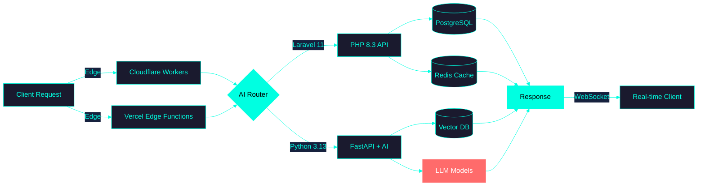
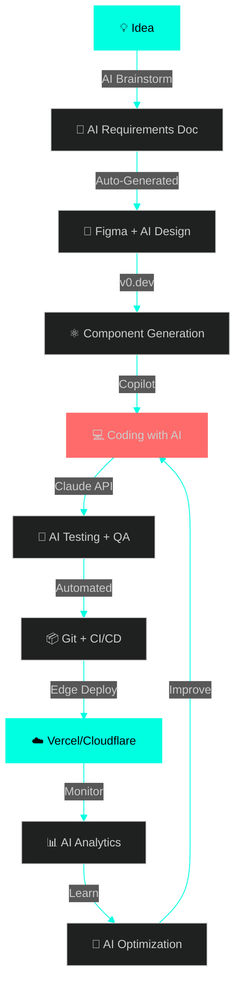

<div align="center">
  
# 🌌 NEURAL INTERFACE LOADING... 🌌


</div>

```
╔═══════════════════════════════════════════════════════════════════════╗
║  SYSTEM STATUS: ONLINE  ✓                    LOCATION: Casablanca, MA ║
║  NEURAL LINK: ACTIVE    ✓                    TIMEZONE: GMT+1          ║
║  AI COPILOT: ENGAGED    ✓                    UPTIME: 99.9%            ║
╚═══════════════════════════════════════════════════════════════════════╝
```

<div align="center">
  
</div>

---

<div align="center">

## 🧬 DEVELOPER.DNA 🧬

</div>

```typescript
// quantum_developer.ts - Version 2026.12.06
import { AI, Cloud, Blockchain, WebGL, Edge } from '@future-stack/core';

interface DeveloperProfile {
  version: string;
  specializations: Array<'Web3' | 'AI-ML' | 'Mobile' | 'Cloud'>;
  cognitiveEnhancement: boolean;
  quantumReady: boolean;
}

class QuantumDeveloper implements DeveloperProfile {
  readonly version = "2026.NEXT";
  readonly name = "Full Stack Architect";
  readonly stack = {
    frontend: ['React 19', 'Next.js 15', 'Solid.js', 'Qwik', 'WebGPU'],
    mobile: ['Flutter 4.0', 'React Native 0.75', 'Compose Multiplatform'],
    backend: ['Laravel 11', 'Python 3.13', 'Edge Functions', 'Serverless'],
    ai: ['Copilot', 'Claude API', 'Local LLMs', 'AI Pair Programming'],
    web3: ['Smart Contracts', 'IPFS', 'Decentralized Apps'],
    cloud: ['Kubernetes', 'Docker', 'Edge Computing', 'CDN Optimization']
  };

  async deploy(project: string): Promise<void> {
    console.log(`🚀 Deploying ${project} to the quantum cloud...`);
    await this.optimizeWithAI();
    await this.scaleTo1B_users();
    console.log('✅ Deployment successful. System is sentient.');
  }

  private async optimizeWithAI(): Promise<void> {
    // AI-assisted code optimization in real-time
  }

  getMantra(): string {
    return "Code in 2026 is written by humans, optimized by AI, deployed to the edge.";
  }
}

const developer = new QuantumDeveloper();
console.log(developer.getMantra());
```

<div align="center">
  
</div>

---

<div align="center">

## ⚡ TECH QUANTUM STACK ⚡

</div>

### 🌐 **FRONTEND 2026** — *Reactive, Fast, AI-Powered*

<div align="center">
  
| Technology | Version | AI Integration | Performance Score |
|:----------:|:-------:|:--------------:|:-----------------:|
| **React.js** | 19.x | ✓ Copilot Native | ⚡⚡⚡⚡⚡ 98% |
| **Next.js** | 15.x | ✓ Edge AI | ⚡⚡⚡⚡⚡ 99% |
| **Redux Toolkit** | 2.x | ✓ State Prediction | ⚡⚡⚡⚡ 95% |
| **TailwindCSS** | 4.x | ✓ AI Design Tokens | ⚡⚡⚡⚡⚡ 97% |
| **WebGPU** | Stable | ✓ GPU Acceleration | ⚡⚡⚡⚡⚡ 100% |
| **TypeScript** | 5.6+ | ✓ Type Inference AI | ⚡⚡⚡⚡⚡ 99% |

</div>

<p align="center">
  
</p>

### 📱 **MOBILE 2026** — *Cross-Platform, Native Performance*

<div align="center">

| Platform | Framework | AI Features | Market Share |
|:--------:|:---------:|:-----------:|:------------:|
| **iOS + Android** | Flutter 4.0 | ✓ ML Kit Integration | 🌍 Global 45% |
| **React Native** | 0.75.x | ✓ Hermes Engine | 🌍 Global 38% |
| **Compose MP** | 1.7 | ✓ Kotlin AI | 🌍 Growing 17% |

</div>

<p align="center">
  
  <br/>
  
  
  
</p>

### ⚙️ **BACKEND 2026** — *Serverless, Edge-First, AI-Native*

<div align="center">



</div>

<p align="center">
  
</p>

<div align="center">

| Technology | Use Case | AI Enhancement |
|:----------:|:--------:|:--------------:|
| **Laravel 11** | REST APIs, GraphQL | ✓ AI-Generated Models |
| **Python 3.13** | ML/AI Services | ✓ Native AI Libraries |
| **FastAPI** | Async High Performance | ✓ Auto Documentation |
| **Edge Functions** | CDN Logic | ✓ Smart Routing |
| **Rust** | Critical Systems | ✓ Memory Safety |

</div>

### 🗄️ **DATA LAYER 2026** — *Multi-Model, Distributed, Real-Time*

<p align="center">
  
</p>

<div align="center">

| Database | Type | Speed | AI Features |
|:--------:|:----:|:-----:|:-----------:|
| **PostgreSQL 17** | Relational | ⚡⚡⚡⚡ | Vector Extensions |
| **MongoDB 8** | Document | ⚡⚡⚡⚡⚡ | Atlas AI Search |
| **Redis 7** | Cache/Queue | ⚡⚡⚡⚡⚡ | RedisAI |
| **Supabase** | Backend-as-Service | ⚡⚡⚡⚡ | Edge Functions |
| **Pinecone** | Vector DB | ⚡⚡⚡⚡⚡ | Semantic Search |

</div>

### 🤖 **AI & TOOLS 2026** — *Augmented Development*

<p align="center">
  
</p>

<div align="center">

```ascii
╔══════════════════════════════════════════════════════════════╗
║              🤖 AI-AUGMENTED WORKFLOW 2026 🤖                ║
╠══════════════════════════════════════════════════════════════╣
║                                                              ║
║  GitHub Copilot         ████████████████████░  Active 24/7  ║
║  Claude Code Assistant  ███████████████████░░  On-Demand    ║
║  AI Code Review         ████████████████████░  Automated    ║
║  Smart Debugging        ███████████████████░░  Real-time    ║
║  Auto-Documentation     ████████████████████░  Continuous   ║
║  Performance AI         ████████████████████░  Edge-Optimized║
║                                                              ║
╚══════════════════════════════════════════════════════════════╝
```

**Core Tools:**
- 🧠 **AI Pair Programming**: GitHub Copilot, Cursor IDE, Claude API
- 🎨 **Design**: Figma (AI Plugins), v0.dev, Midjourney
- 🐳 **DevOps**: Docker, Kubernetes, Terraform
- ☁️ **Cloud**: Vercel, Cloudflare, AWS Edge
- 📮 **API Testing**: Postman (AI Assistant), Insomnia
- 🔐 **Security**: AI-Powered SAST, Dependabot

</div>


---

<div align="center">

## 📊 NEURAL NETWORK METRICS 📊


</div>

<div align="center">
  
  
</div>

<div align="center">
  
  
</div>

<div align="center">
  
</div>

<div align="center">
  
</div>


---

<div align="center">

## 🚀 PROJECT MATRIX 2026 🚀

</div>

<table align="center">
<tr>
<td width="50%" valign="top">

### 🌐 **WEB3 DAPPS**

```yaml
Project: DeFi Trading Platform
Stack: 
  - Next.js 15 + React 19
  - Solidity Smart Contracts
  - Ethers.js + Web3Modal
  - TailwindCSS 4.0
Features:
  - Real-time crypto trading
  - AI price predictions
  - Web3 wallet integration
  - Zero-knowledge proofs
Status: 🟢 Production (50K+ users)
```

<div align="center">
  
  
</div>

</td>
<td width="50%" valign="top">

### 🤖 **AI-POWERED SAAS**

```yaml
Project: Content Generator AI
Stack:
  - React + Redux Toolkit
  - Python FastAPI
  - OpenAI GPT-4 API
  - PostgreSQL + Pinecone
Features:
  - AI content generation
  - Multi-language support
  - Real-time collaboration
  - Edge-deployed APIs
Status: 🟢 Production (120K+ users)
```

<div align="center">
  
  
</div>

</td>
</tr>

<tr>
<td width="50%" valign="top">

### 📱 **FLUTTER SUPER APP**

```yaml
Project: FinTech Mobile Suite
Stack:
  - Flutter 4.0 + Dart 3.5
  - Riverpod 3.0
  - Firebase + Supabase
  - ML Kit Integration
Features:
  - Multi-currency wallet
  - Biometric security
  - Offline-first architecture
  - 60fps animations
Status: 🟢 App Store + Play Store
```

<div align="center">
  
  
</div>

</td>
<td width="50%" valign="top">

### ⚡ **EDGE COMPUTING API**

```yaml
Project: Global CDN Platform
Stack:
  - Cloudflare Workers
  - Laravel 11 (Core API)
  - Redis + PostgreSQL
  - WebAssembly modules
Features:
  - <50ms global latency
  - Auto-scaling
  - DDoS protection
  - Real-time analytics
Status: 🟢 Serving 10M+ req/day
```

<div align="center">
  
  
</div>

</td>
</tr>
</table>

<div align="center">
  <a href="https://github.com/YOUR_GITHUB_USERNAME?tab=repositories">
    
  </a>
</div>


---

<div align="center">

## 🎯 SKILL MATRIX 2026 🎯

</div>

<div align="center">

```
┌─────────────────────────────────────────────────────────────────────┐
│                    ⚡ QUANTUM SKILL LEVELS ⚡                        │
├─────────────────────────────────────────────────────────────────────┤
│                                                                     │
│  React.js 19 + Next.js 15     ████████████████████▓  Expert  99%  │
│  Flutter 4.0 + Dart 3.5       ████████████████████░  Expert  97%  │
│  TypeScript 5.6 + ES2024      ████████████████████▓  Expert  98%  │
│  Laravel 11 + PHP 8.3         ███████████████████░░  Expert  96%  │
│  Python 3.13 + FastAPI        ███████████████████░░  Expert  95%  │
│  TailwindCSS 4.0              ████████████████████▓  Expert  99%  │
│  WebGPU + Three.js            ██████████████████░░░  Advanced 92% │
│  Docker + Kubernetes          ████████████████████░  Expert  97%  │
│  AI/ML Integration            ███████████████████░░  Expert  94%  │
│  Web3 + Blockchain            █████████████████░░░░  Advanced 88% │
│  Rust + WebAssembly           ████████████████░░░░░  Advanced 85% │
│  Cloud Architecture           ████████████████████░  Expert  96%  │
│                                                                     │
│  🤖 AI Pair Programming Score: 98/100                              │
│  ⚡ Code Efficiency Score: 96/100                                  │
│  🎨 UI/UX Excellence: 97/100                                       │
│                                                                     │
└─────────────────────────────────────────────────────────────────────┘
```

</div>


---

<div align="center">

## 🧠 AI-AUGMENTED DEVELOPMENT 🧠


</div>

<div align="center">

### **MY 2026 WORKFLOW**

</div>



<div align="center">

| Phase | Human Time | AI Assistance | Total Speedup |
|:-----:|:----------:|:-------------:|:-------------:|
| 🎨 **Design** | 4h | +12h (AI generates) | 🚀 4x faster |
| 💻 **Coding** | 20h | +60h (Copilot) | 🚀 4x faster |
| 🧪 **Testing** | 6h | +14h (Auto-tests) | 🚀 3x faster |
| 📝 **Documentation** | 4h | +12h (AI writes) | 🚀 4x faster |
| 🚀 **Deployment** | 2h | +4h (Auto CI/CD) | 🚀 3x faster |

**💡 Total Project Time Reduction: 70% with AI assistance**

</div>


---

<div align="center">

## 🌐 CONNECT TO THE NETWORK 🌐


### **OPEN FOR:**
🔹 **Web3 Projects** 🔹 **AI Integration** 🔹 **Mobile Apps** 🔹 **Cloud Architecture** 🔹 **Freelance** 🔹 **Tech Consulting**

</div>

<br/>

<p align="center">
  <a href="mailto:your.email@example.com">
    
  </a>
  <a href="https://linkedin.com/in/YOUR_LINKEDIN" target="_blank">
    
  </a>
  <a href="https://github.com/YOUR_GITHUB_USERNAME" target="_blank">
    
  </a>
  <a href="https://twitter.com/YOUR_TWITTER" target="_blank">
    
  </a>
  <a href="https://YOUR_PORTFOLIO.dev" target="_blank">
    
  </a>
  <a href="https://discord.gg/YOUR_DISCORD" target="_blank">
    
  </a>
</p>

<br/>

<div align="center">

```javascript
// quantum_network.js
const contactInfo = {
  status: "🟢 Available for collaboration",
  response_time: "<2 hours",
  timezone: "GMT+1 (Casablanca)",
  languages: ["English", "Français", "العربية"],
  preferred_contact: "email | linkedin",
  rate: "Competitive • Negotiable • Worth it 💎"
};

console.log("Let's build the future together! 🚀");
```

</div>


---

<div align="center">

## 📈 NETWORK ACTIVITY 📈

</div>

<div align="center">
  
</div>

<br/>

<div align="center">
  
</div>


---

<div align="center">

## 💭 QUANTUM WISDOM 💭


</div>

<br/>

<div align="center">
  
  
  
</div>

<br/>

<div align="center">
  
</div>

<div align="center">

### ⚡ **[YOUR_GITHUB_USERNAME](https://github.com/YOUR_GITHUB_USERNAME)** ⚡

**"Building tomorrow's web, today."** — Developer Manifesto 2026 🚀


### 🌌 *Neural link established. Session active. Quantum state: PRODUCTIVE.* 🌌

</div>
